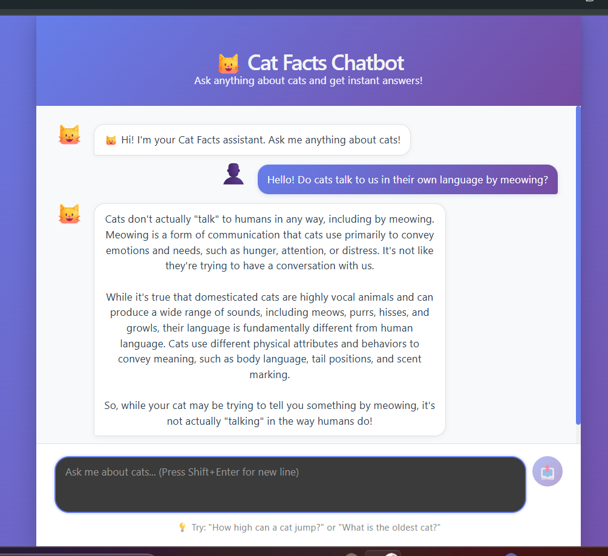

# 🐱 Cat Facts RAG Chatbot

A simple Retrieval-Augmented Generation (RAG) chatbot that answers questions about cats using a small knowledge base of cat facts.

This project is a learning-focused demo that shows how a basic RAG pipeline works end to end:
- retrieve the most relevant facts,
- send them to a language model,
- return a grounded answer in a chat interface.

---

# Dashboard (chatbot)


## 📌 Project Overview

The app combines a Python backend and a React frontend.

When a user asks a question:
1. the question is converted into an embedding vector,
2. the system searches the most relevant cat facts from the knowledge base,
3. the retrieved facts are sent to the language model,
4. the model generates the final answer.

---

## 📁 Project Structure

```text
simple_RAG/
├── app.py
│   Flask API that exposes the chatbot endpoint.
│
├── rag_core.py
│   Core RAG logic:
│   - load the dataset
│   - create embeddings
│   - retrieve relevant chunks
│   - generate the final answer
│
├── rag_system.ipynb
│   Notebook used to test and understand the RAG pipeline step by step.
│
├── cat-facts
│   Text file containing the cat facts used as the knowledge base.
│
├── requirements.txt
│   Python dependencies for the backend.
│
├── README.md
│   Project documentation.
│
└── frontend/
    └── src/
        ├── App.jsx
        │   Main React component.
        │
        ├── chatbot.jsx
        │   Chat interface for sending questions and displaying answers.
        │
        ├── chatbot.css
        │   Styling for the chatbot UI.
        │
        ├── App.css
        │   Global app styles.
        │
        └── main.jsx
            Entry point of the React application.
```


---

## ⚙️ How It Works

### 1. Load the knowledge base
The file `cat-facts` contains around 150 lines of cat facts. Each line is treated as one chunk of knowledge.

### 2. Convert facts into embeddings
Each fact is passed to an Ollama embedding model. The text is transformed into a numerical vector.

### 3. Store vectors in memory
The vectors are stored in `VECTOR_DB`, which acts as a simple in-memory vector database.

### 4. Retrieve relevant facts
When a user asks a question, the system embeds the query, compares it with all stored facts using cosine similarity, and keeps the most relevant ones.

### 5. Generate the final response
The retrieved facts are sent to the language model, which generates an answer using only that context.

---

## 🧠 RAG Workflow

```text
User Question
      ↓
Question Embedding
      ↓
Similarity Search
      ↓
Top Relevant Cat Facts
      ↓
Language Model
      ↓
Final Answer
```

---

## 🛠️ Technologies Used

- Python
- Flask
- React
- Ollama
- Jupyter Notebook
- Cosine similarity

---

## 🚀 Setup Instructions

### Prerequisites

- Python 3.8+
- Node.js 16+
- Ollama installed and running

### Install backend dependencies

```bash
pip install -r requirements.txt
```

### Install frontend dependencies

```bash
cd frontend
npm install
```

---

## ▶️ Run the Project

### Start the backend

```bash
python app.py
```

### Start the frontend

```bash
cd frontend
npm run dev
```

The app will be available at:

- Frontend: `http://localhost:5173`
- Backend API: `http://localhost:5000`

---

## 💬 Example Questions

Try questions like:

- What is a group of cats called?
- How many teeth does a cat have?
- How high can a cat jump?
- What is the oldest cat on record?
- Why do cats hate water?

---

## 🌐 API Endpoints

### `POST /chat`

Send a message to the chatbot.

**Request:**

```json
{
  "message": "What is a group of cats called?"
}
```

**Response:**

```json
{
  "success": true,
  "message": "What is a group of cats called?",
  "answer": "A group of cats is called a clowder."
}
```

### `GET /health`

Check if the API is running.

**Response:**

```json
{
  "status": "ok",
  "message": "RAG Chatbot API is running"
}
```

---

## 📦 Main Files Explained

### `app.py`
Starts the Flask API and exposes the `/chat` endpoint.

### `rag_core.py`
Contains the main RAG logic:
- load the cat facts
- create embeddings
- compute similarity
- retrieve relevant chunks
- generate responses

### `rag_system.ipynb`
Notebook version of the project for experimenting and understanding each step.

### `frontend/src/chatbot.jsx`
Chatbot interface where the user types a question and receives an answer.

### `frontend/src/chatbot.css`
Visual styling of the chatbot interface.

---

## ✨ Features

- Simple RAG architecture
- Local embeddings and generation with Ollama
- Flask backend API
- React frontend UI
- Clean and easy-to-understand structure
- Good learning project for understanding RAG

---

## 🔮 Possible Improvements

- Save chat history
- Add dark mode
- Support multiple languages
- Add authentication
- Use a persistent vector database
- Stream responses in the frontend

---

## 👤 Author

**Youssef Ennagui**  
Data Science Student at FSDM Fes

---

## 📄 License

MIT
